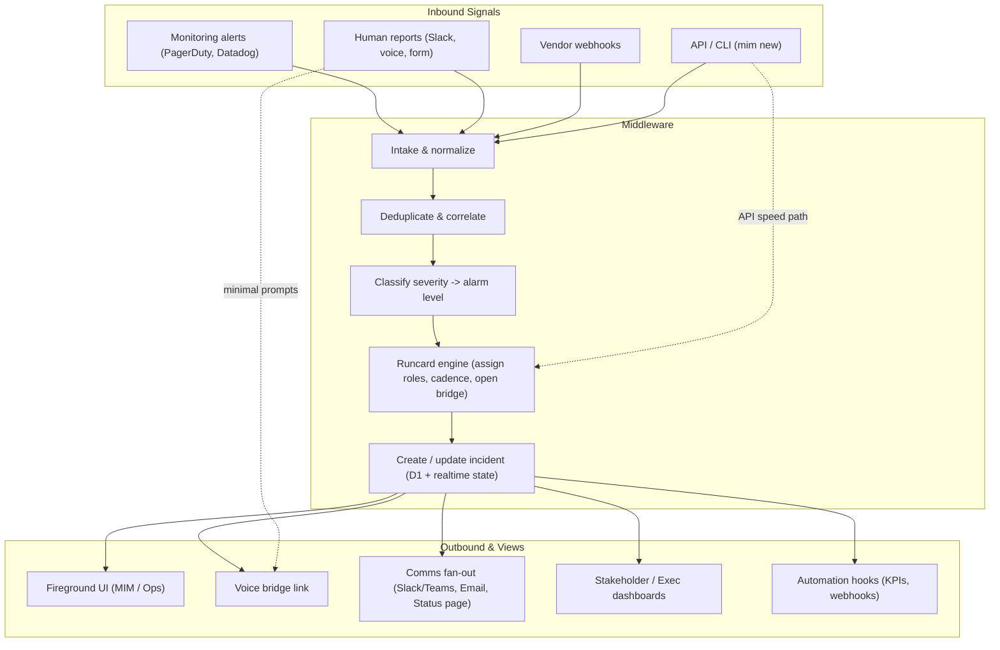

# Signal Flow — Standardized Inbound → Outbound

> MajorOps as middleware: normalize noisy signals, run the runcard engine, and emit clean escalations with minimal friction.

**Low-friction lane:** DevOps can hit the API/CLI or give a minimal human report and jump straight to bridge + standardized comms; the runcard engine fills roles/cadence at API speed.

**Standardization:** The runcard and KPI layers ensure every outbound signal is consistent, auditable, and reusable across scorecards.
